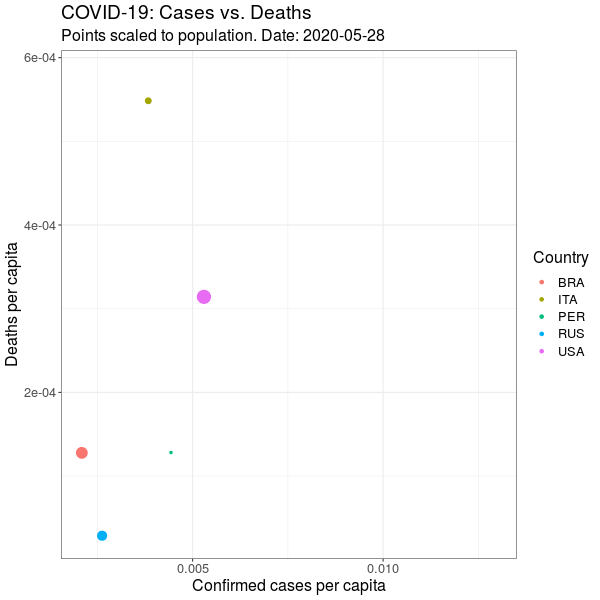

# [Covidgraphics](https://github.com/rnnh/covidgraphics)

by [Ronan Harrington](https://github.com/rnnh/)

This is a [Shiny](https://shiny.rstudio.com/) app written in `R` that creates graphs using Covid-19 data, which can also be run locally.
`R` version 4.0.2 or later and RStudio version 1.3.959 or later are required to run this app locally.
This app the [COVID-19 Data Hub](https://cran.r-project.org/web/packages/COVID19/) `R` package.

It can be viewed online at: <https://rnnh.shinyapps.io/covidgraphics/>

## Example output

## References

- Guidotti, E., Ardia, D., (2020), "COVID-19 Data Hub", Journal of Open Source Software 5(51):2376, doi: [10.21105/joss.02376](https://doi.org/10.21105/joss.02376).